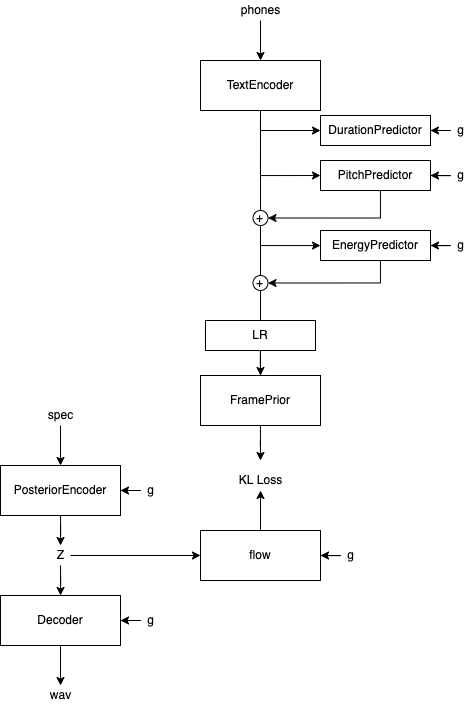

# visinger-speech

基于fs2、vits、visinger的tts模型

（暂时还在开发调试中）

[//]: # (音频sample见[samples]&#40;/samples&#41;)
## 模型结构
总的来说基本就是将fastspeech2的VarianceAdapter结构添加进了vits

## 相比于原版vits
+ 删除了 Monotonoic Alignment， 使用MFA对齐后输入时长
+ 添加了音素级 F0Predictor，EnergyPredictor
+ 可以逐音素手动编辑音高、音量和时长
+ 添加了FramePriorNetwork
+ 使用飞桨paddlespeech作为中文文本前端，实现更可靠的文本正则化以及G2P
+ 采样率使用44100hz
## 参考
+ [vits](https://github.com/jaywalnut310/vits)
+ [FastSpeech2](https://github.com/ming024/FastSpeech2)
+ [Period VITS](https://arxiv.org/pdf/2210.15964.pdf) 
+ [VISinger](https://github.com/So-Fann/VISinger) 
